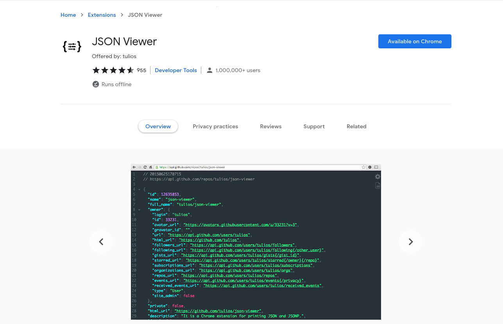

# nC-news API

_A Back-End API build with NodeJS, ExpressJS and PSQL for the purpose of interacting with data. The goal of this application is to provide data to the Front-End architecture._

**Live URL**: [https://nenad-nc-news-api.herokuapp.com/api](https://nenad-nc-news-api.herokuapp.com/api)

## Download

---

You can find the repository on my [**GitHub**](https://github.com/Nesh00/news-api) account and clone it down or just download the ZIP file.

```
git clone https://github.com/Nesh00/news-api.git
```

## Basic requirements

---

If you want to run this app on your local machine, make sure you have versions [**NodeJS v16.11.0**](https://nodejs.org/en/) and [**PostgreSQL 12.9**](https://www.postgresql.org/) installed.

## Installation

---

Once you have the repository on your computer, install the npm packages.

```
npm install
```

## Create .env files

---

Create two files **.env-development** and **.env-test**.

```
PGDATABASE=nc_news
```

```
PGDATABASE=nc_news_test
```

## Create Database

---

Once npm packages are installed, run the command bellow. What this will do is create two databases, one for development purpose and one for testing.

```
npm run setup-dbs
```

## Seed Database

---

### Seed testing database:

```
npm test
```

These tests were created using [**Jest**](https://jestjs.io/), [**jest-sorted**](https://www.npmjs.com/package/jest-sorted) and [**supertest**](https://www.npmjs.com/package/supertest).

### Seed development database:

```
npm run seed
```

## View JSON data

---

For better view on JSON data in the browser I would recommend adding [**JSON Viewer**](https://chrome.google.com/webstore/detail/json-viewer/gbmdgpbipfallnflgajpaliibnhdgobh) extension if you're using Google Chrome.



## Future development

---

My future goal for this app is:

- Create a POST request on users table for new user
- Add pagination on both articles and comments
- PATCH request on comments to edit them
- POST, PATCH and DELETE articles
